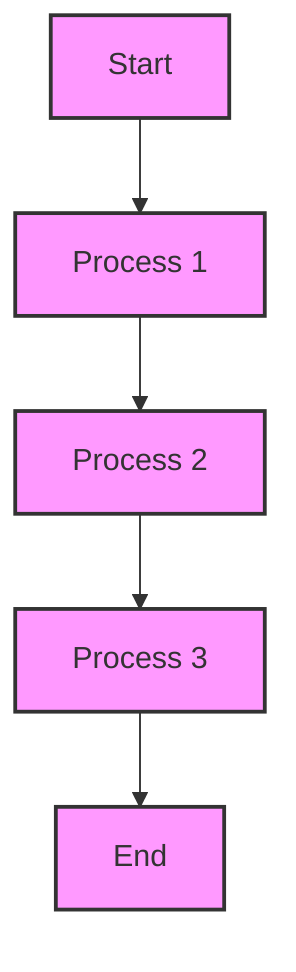

# :

## Executive Summary

{Brief overview of the project and its purpose - 2-3 sentences}

---

## 1. Research Findings

### Key Concepts

- **{Concept 1}**: {Brief description}
- **{Concept 2}**: {Brief description}
- **{Concept 3}**: {Brief description}
- **{Concept 4}**: {Brief description}
- **{Concept 5}**: {Brief description}

### Key Applications

1. **{Application 1}**: {Brief description}
2. **{Application 2}**: {Brief description}
3. **{Application 3}**: {Brief description}
4. **{Application 4}**: {Brief description}
5. **{Application 5}**: {Brief description}

### Relevant Resources

- [{Resource 1}]({URL})
- [{Resource 2}]({URL})
- [{Resource 3}]({URL})
- [{Resource 4}]({URL})

---

## 2. GitHub Research

{Summary of GitHub findings - repositories, code examples, etc.}

---

## 3. System Architecture

### Flowchart

---

## 4. Implementation Plan

### Phase 1:

1. **{Step 1}**

   - {Sub-step 1}
   - {Sub-step 2}
2. **{Step 2}**

   - {Sub-step 1}
   - {Sub-step 2}

### Phase 2:

3. **{Step 3}**

   - {Sub-step 1}
   - {Sub-step 2}
4. **{Step 4}**

   - {Sub-step 1}
   - {Sub-step 2}

### Phase 3:

5. **{Step 5}**

   - {Sub-step 1}
   - {Sub-step 2}
6. **{Step 6}**

   - {Sub-step 1}
   - {Sub-step 2}

### Phase 4:

7. **{Step 7}**

   - {Sub-step 1}
   - {Sub-step 2}
8. **{Step 8}**

   - {Sub-step 1}
   - {Sub-step 2}

---

## 5. Implementation Prompt

> "{Your prompt for Grok 3 or other AI assistant}"

---

## 6. Next Steps

- {Next step 1}
- {Next step 2}
- {Next step 3}
- {Next step 4}

